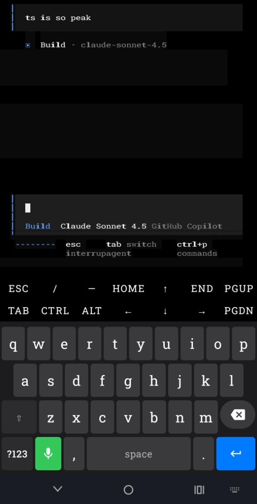
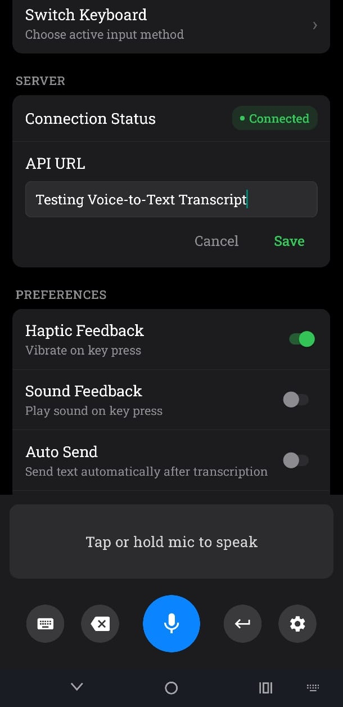

<p align="center">
  
</p>

<h1 align="center">Voice Keyboard</h1>

<p align="center">
  <strong>A powerful Android keyboard with voice-to-text transcription</strong>
</p>

<p align="center">
  <a href="#features">Features</a> •
  <a href="#architecture">Architecture</a> •
  <a href="#getting-started">Getting Started</a> •
  <a href="#building-for-production">Production Build</a>
</p>

---

<p align="center">
  
  &nbsp;&nbsp;
  
</p>

---

## Features

- **Voice Input** - Hold to record, release to transcribe
- **Text Keyboard** - Full QWERTY keyboard with symbols and numbers
- **Space Bar Joystick** - Swipe on space bar to move cursor left/right
- **Swipe-to-Delete** - Hold backspace and swipe to select and delete words
- **Terminal Support** - Works with terminal apps including TUI applications
- **Haptic Feedback** - Configurable vibration on key press
- **Auto-Send** - Optionally auto-send text after transcription

## Architecture

```
voice-keyboard/
├── android/          # Native Android IME (Input Method Editor)
├── backend/          # Bun.js transcription server
├── src/              # React Native app (settings UI)
└── assets/           # App assets and logo
```

### Components

| Component            | Description                                            |
| -------------------- | ------------------------------------------------------ |
| **Android IME**      | Native Kotlin keyboard service with Jetpack Compose UI |
| **Backend Server**   | Bun.js server for speech-to-text transcription         |
| **React Native App** | Configuration app for keyboard settings                |

### Backend

The backend handles speech-to-text transcription.

See [backend/README.md](backend/README.md) for setup.

## Getting Started

### Prerequisites

- Node.js 18+ or Bun
- Android Studio with SDK 24+
- React Native CLI
- JDK 17

### Installation

```bash
# Clone the repository
git clone https://github.com/sahilchouksey/voice-keyboard.git
cd voice-keyboard

# Install dependencies
npm install

# Start Metro bundler
npm start

# Build and run on device/emulator
npm run android
```

### Enable the Keyboard

1. Open the Voice Keyboard app
2. Grant microphone permission
3. Go to Settings > System > Keyboard > Manage keyboards
4. Enable "Voice Keyboard"
5. Select Voice Keyboard as your input method

### Configure Server URL

In the app settings, set the API URL to your backend server:

- Local development: `http://192.168.x.x:3002`
- Production: `https://your-server.com?api_key=your_key`

## Building for Production

```bash
# Clean build
npm run android:clean

# Build release APK
npm run android:release
# Output: android/app/build/outputs/apk/release/app-release.apk

# Build release bundle (Play Store)
npm run android:bundle
# Output: android/app/build/outputs/bundle/release/app-release.aab
```

### Signing Configuration

For release builds, create `android/app/keystore.properties` (gitignored):

```properties
storeFile=release.keystore
storePassword=your-store-password
keyAlias=your-key-alias
keyPassword=your-key-password
```

Then generate a keystore:

```bash
keytool -genkeypair -v \
  -keystore android/app/release.keystore \
  -alias your-key-alias \
  -keyalg RSA -keysize 2048 -validity 10000
```

## Troubleshooting

### Keyboard not appearing

- Ensure the keyboard is enabled in system settings
- Check that microphone permission is granted

### Transcription failing

- Verify the backend server is running and accessible
- Check the API URL in settings (use your computer's IP, not localhost)
- Ensure API key is correct for production servers

### Cursor movement not working in terminal apps

- The keyboard uses Ctrl+B/F for cursor movement in terminals
- This works with most TUI apps including OpenCode

## License

MIT License - see [LICENSE](LICENSE) for details.
